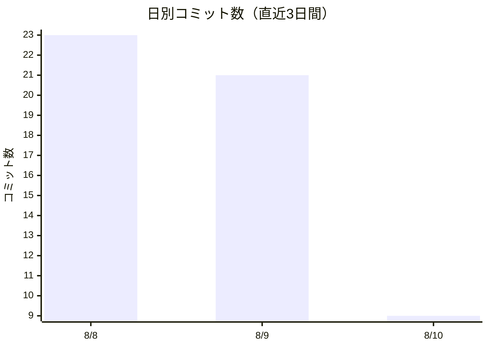
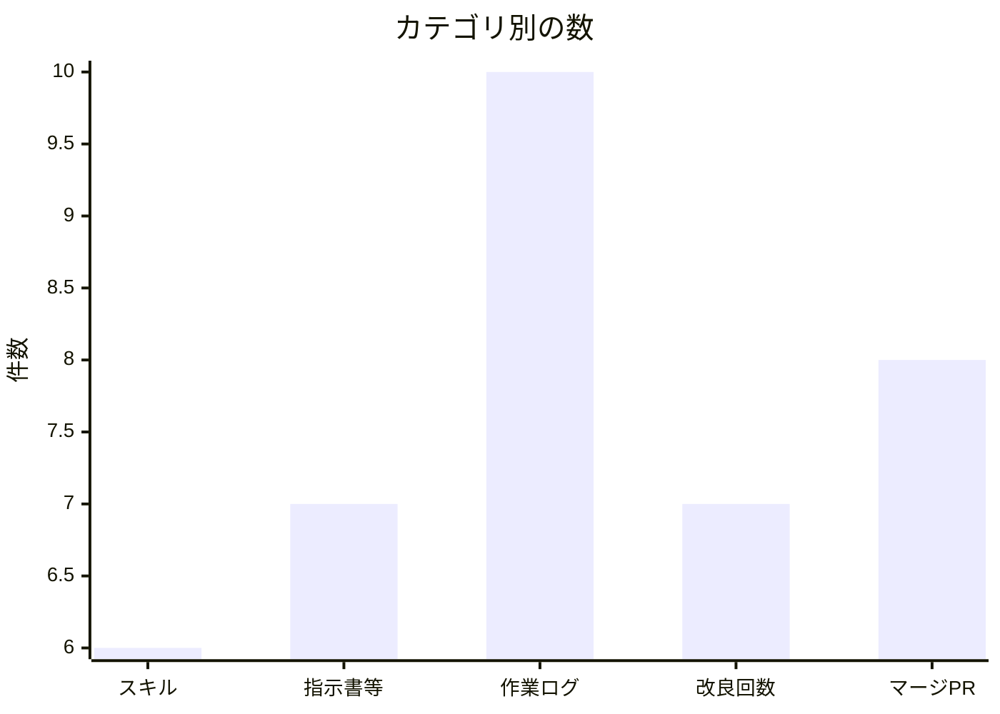

> このファイルは `tools/shinka_metrics.py` が自動生成します（🔁グラフのループ）。手で編集しないでください。
> 生成日時: 2026-08-10 04:26

# 🌱 のんラボ 進化レポート

## 📊 メトリクス一覧

| 項目 | 数字 |
|------|------|
| 🧩 スキル数 | 6 |
| 📚 ドキュメント数 | 25 |
| 📗 指示書・手順書・ガイド類 | 7 |
| 📝 作業ログ数 | 10 |
| 🌱 自己改良の実施回数 | 7 |
| 💾 総コミット数 | 53 |
| 🔀 マージ済みPR数（推定） | 8 |
| 🌐 公開ページ数 | 3 |

> 🌐 公開ページ数は固定値（3）です。内訳: `index.html`（入口ページ）・`typhoon-app/`（台風情報まとめ）・`bousai-app/`（防災情報まとめ）の3つだけをWebに公開しているため。

## 📈 グラフ1: 日別コミット数（直近3日間）

> ⚠️ この環境はGit履歴の一部（2026-08-08 以降）しか持っていません（クラウドの部屋の仕様）。そのため総コミット数・マージPR数・グラフは**その範囲での数字**です。全期間の正確な数字は、ローカル（全履歴あり）で実行すると出ます。

## 📈 グラフ2: カテゴリ別の数

## 🔍 数字の見かた

- ここにある数字は、のんラボが「育っている証拠」です。スキルやドキュメントが増えるほど、AIと一緒にできることが増えています。
- コミット数やPR数が増えるのは、実際に手を動かして直したり作ったりした回数です。多い＝サボらず育てている、ということです。
- 自己改良の実施回数は、毎日すこしずつ良くする仕組み（🌱 kaizen）がちゃんと動いている証です。
