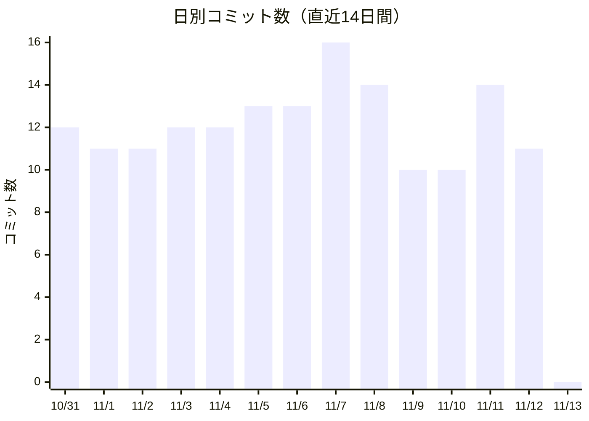
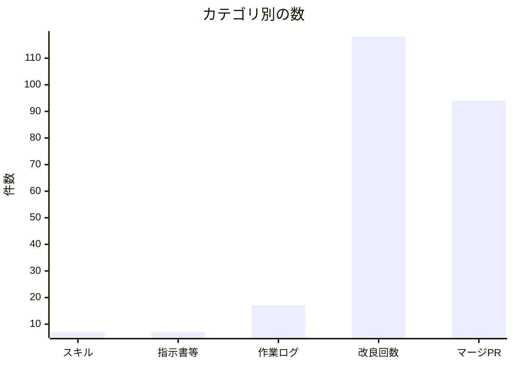

> このファイルは `tools/shinka_metrics.py` が自動生成します（🔁グラフのループ）。手で編集しないでください。
> 生成日時: 2026-11-13 06:12

# 🌱 のんラボ 進化レポート

## 📊 メトリクス一覧

| 項目 | 数字 |
|------|------|
| 🧩 スキル数 | 7 |
| 📚 ドキュメント数 | 33 |
| 📗 指示書・手順書・ガイド類 | 7 |
| 📝 作業ログ数 | 17 |
| 🌱 自己改良の実施回数 | 118 |
| 💾 総コミット数 | 1941 |
| 🔀 マージ済みPR数（推定） | 94 |
| 🌐 公開ページ数 | 5 |

> 📚 ドキュメント数は `docs/` の `.md` を全部数えた枚数で、**目次そのもの（`docs/README.md`）も入っています**。いっぽう `npm run check:map` は「目次に載せる相手」だけを数えるので**1枚少なく（いまは32枚）**表示されます。数字が食い違って見えても、どちらも正しいです。

> 🌐 公開ページ数は、公開ワークフロー（`pages-deploy.yml`）が実際に配置しているものを数えています。Webに出しているのは入口ページと各アプリだけで、作業ログ・脚本・台帳（`livecam-db/`）は公開していません。

## 📈 グラフ1: 日別コミット数（直近14日間）

```mermaid
xychart-beta
    title "日別コミット数（直近14日間）"
    x-axis ["10/31", "11/1", "11/2", "11/3", "11/4", "11/5", "11/6", "11/7", "11/8", "11/9", "11/10", "11/11", "11/12", "11/13"]
    y-axis "コミット数"
    bar [12, 11, 11, 12, 12, 13, 13, 16, 14, 10, 10, 14, 11, 0]
```

## 📈 グラフ2: カテゴリ別の数

```mermaid
xychart-beta
    title "カテゴリ別の数"
    x-axis ["スキル", "指示書等", "作業ログ", "改良回数", "マージPR"]
    y-axis "件数"
    bar [7, 7, 17, 118, 94]
```

## 🔍 数字の見かた

- ここにある数字は、のんラボが「育っている証拠」です。スキルやドキュメントが増えるほど、AIと一緒にできることが増えています。
- コミット数やPR数が増えるのは、実際に手を動かして直したり作ったりした回数です。多い＝サボらず育てている、ということです。
- 自己改良の実施回数は、毎日すこしずつ良くする仕組み（🌱 kaizen）がちゃんと動いている証です。
